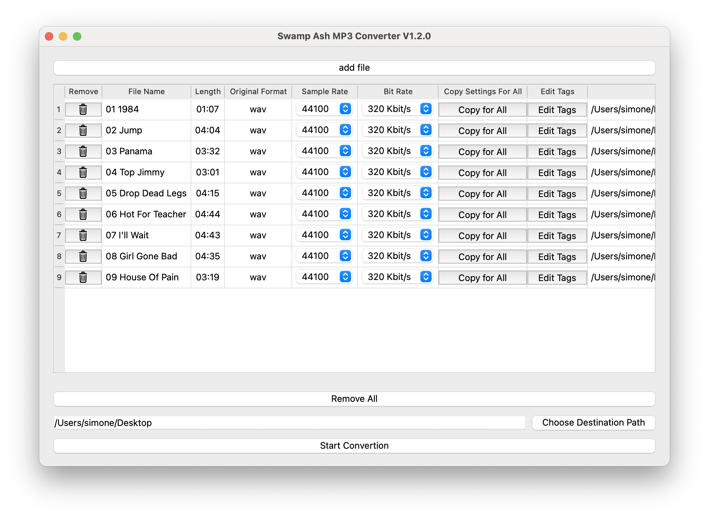

# Swamp Ash MP3 Converter

**Swamp Ash MP3 Converter** is a lightweight, cross-platform, open source app to easily convert audio files to `.mp3`, with adjustable bitrate from 32 to 320 kbps. Written in Python with a PyQt6 GUI, it leverages the power of `ffmpeg` to deliver reliable, high-quality conversion.

## Features

- Supports audio input formats: `.wav`, `.mp3`, `.aac`, `.wma`, `.3gpp`
- Output always in `.mp3`, from **32 kbps** up to **320 kbps**
- Simple and intuitive interface (PyQt6)
-  `ffmpeg` bundled directly inside the app  
- Cross-platform (for now, the executable with bundled `ffmpeg` is available only for **macOS** – support for other OSes is coming soon)
- Edit main MP3 tags (title, artist, album, year, genre)
- Licensed under **GPLv3**

## Multiple File Conversion

Convert single files or entire lists of audio files at once, choosing your desired bitrate. Easy, fast, and efficient.

## Screenshot

## License

This project is released under the **GNU GPL v3** license. You are free to use, modify, and redistribute it, provided you keep the same license.

---

**Author:** Simone De Angelis
